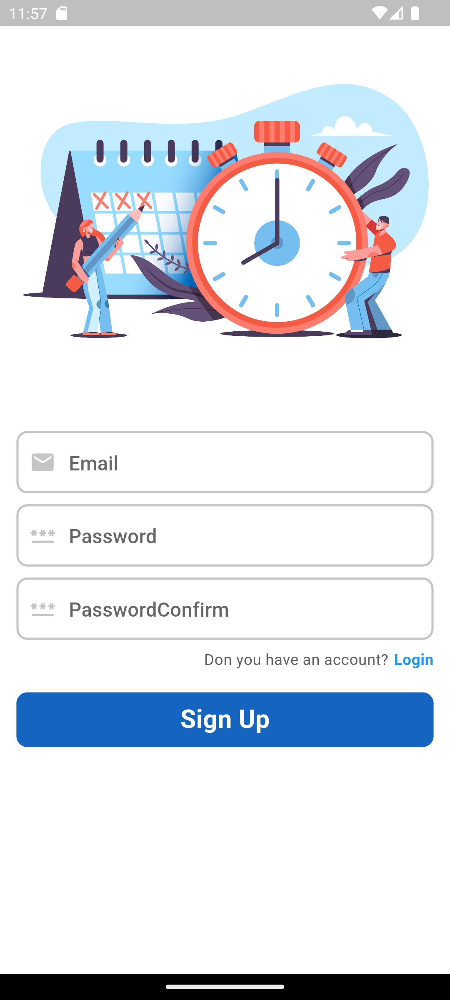

# Flutter ToDo Application - TaskTick

## Overview

This ToDo application is a simple, user-friendly mobile app built with Flutter and backed by Firebase. It allows users to manage their daily tasks efficiently. With features such as authentication, task addition, and task editing, it provides a seamless experience for personal task management.


## Features

- **Firebase Authentication**: Securely login or sign up to access your tasks.
- **Firestore Remote Storage**: Data is saved securely linked to each user remotely over the cloud. 
- **Add Tasks**: Easily add new tasks with a detailed description.
- **Edit Tasks**: Update your tasks as needed.
- **Task Management**: View pending and completed tasks in an organized list.


## Setting Up

To set up the application on your machine, follow these steps:

1. Ensure you have Flutter installed on your system. If not, follow the instructions [here](https://flutter.dev/docs/get-started/install).

2. Clone the repository to your local machine using:

    ```sh
    git clone https://github.com/ssingh301/Flutter-TaskTick.git
    ```

3. Navigate into the project directory:

    ```sh
    cd Flutter-TaskTick
    ```

4. Install the necessary dependencies:

    ```sh
    flutter pub get
    ```

5. Create a new Firebase project and follow the steps to add a Flutter app. Check Firebase documentation [here](https://firebase.google.com/docs/flutter/setup).

6. Download the `google-services.json` file and place it in the `android/app` directory.

7. Run the application:

    ```sh
    flutter run
    ```


## Authentication Screens

- The login screen allows existing users to enter their credentials and access their tasks.
- The signup screen lets new users create an account to store and manage tasks.




## Home Page Screen 
- Home page screen shows the user the list of the tasks in 2 sections, depending upon if they are pending or completed. 
- As soon as user checks the checkbox, the Task is moved to Complete task Section

- Each user can see their own Tasks only 
  


## Add Task Screen 
- User can add Task title and Subtitile and hit the ADD TASK button. 
- Task will be saved remotely in firestore which can be accessed remotely. 
  


## Feedback

If you encounter any issues or have suggestions for improvements, please file an issue in the GitHub repository.

